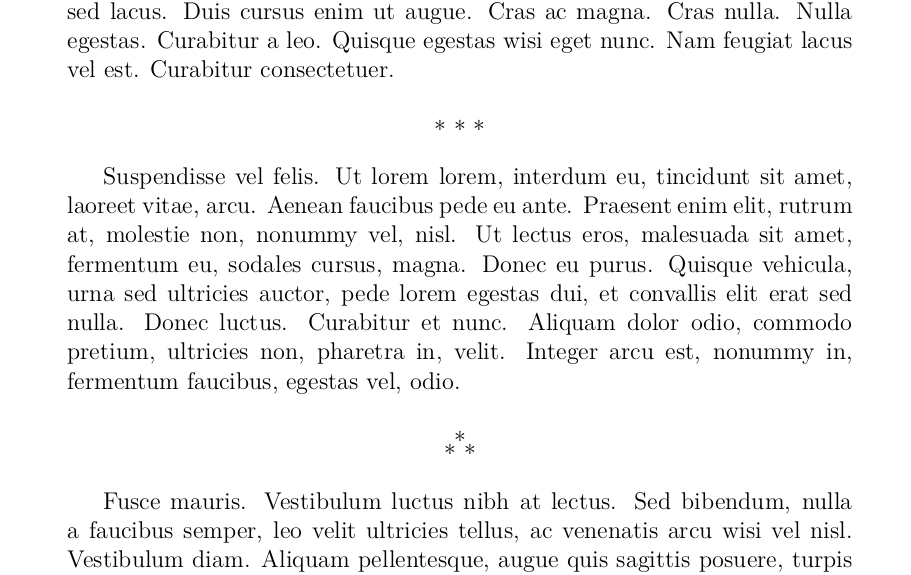

# Dinkus and asterism package for LaTeX

To use this, copy `dinkus.sty` to your project directory. Has some basic
usability tricks, such as reasonable prevention of bad pagebreaks and easily
tunable vskips.

Then this:
```tex
\usepackage{dinkus}
```

... and this:

```tex
...some text...
\dinkus
...more text...
\asterism
...even more text...
```

... produces something like:



Use `\centerbreak` or `\textbreak` to define your favorite dinkuses, and
redefine `\textbreaktopskip` and `\textbreakbottomskip` to fix up spacing.

Books are nicer with dinki! (Is that a plural of a dinkus?)

You might also enjoy the [`froufrou`](https://ctan.org/pkg/froufrou) package.

The repository contents are relased into public domain.
